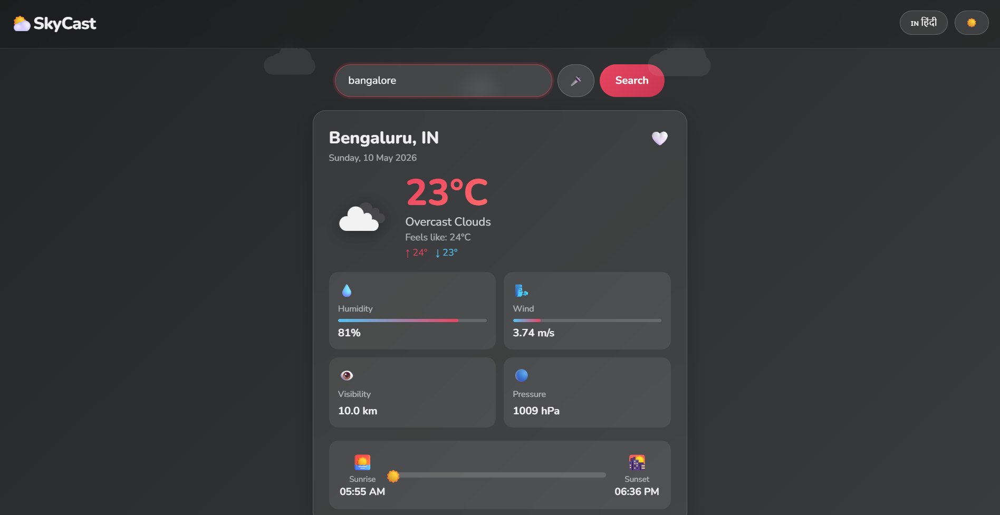
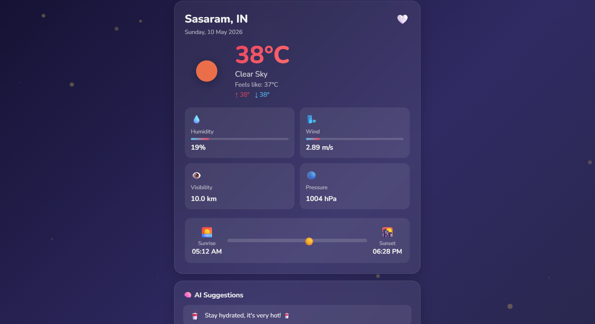
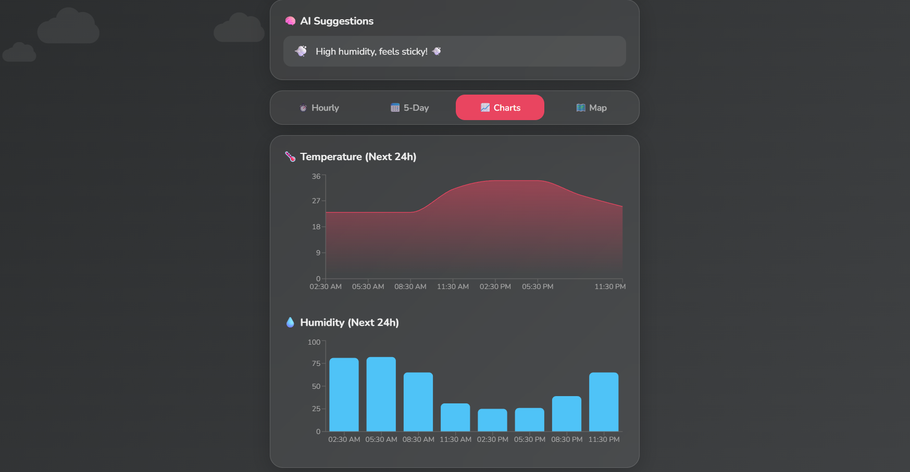
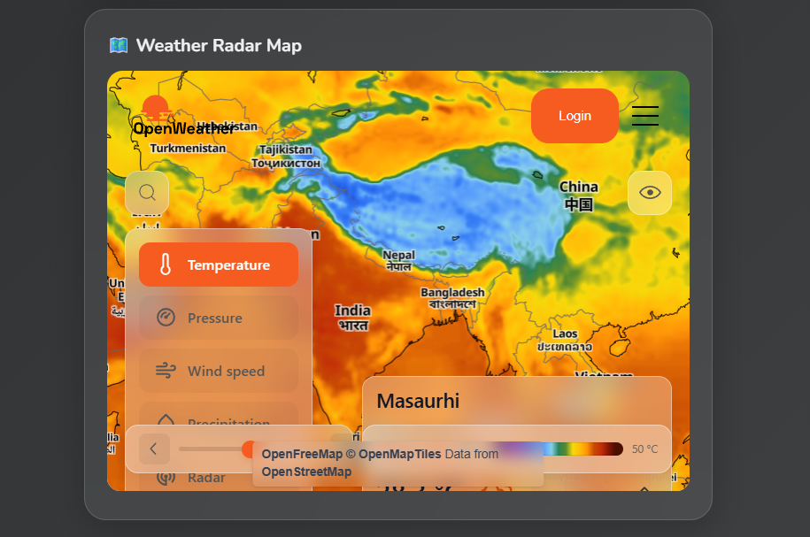

<p align="center">
  <h1 align="center">⛅ SkyCast — Advanced Weather App</h1>
  <p align="center">A feature-rich, modern weather application built with <b>React.js</b> featuring real-time weather data, health insights, AI suggestions, voice search, globe view, and much more — all wrapped in a stunning glassmorphism UI with animated weather effects.</p>
</p>

---

## 🌐 Live 👉 **[https://prahladembedx.github.io/skycast-react/](https://prahladembedx.github.io/skycast-react/)**

---

## 📸 Screenshots






---

## ✨ Features

### 🔍 Core Weather
- 📍 **Auto Location Detection** — Opens with your city's weather automatically
- 🔎 **City Search** — Search any city worldwide instantly
- 🌡️ **Current Weather** — Temperature, feels like, min/max, description
- 💧 **Humidity & Wind** — Visual animated progress bars
- 👁️ **Visibility & Pressure** — Complete atmospheric data
- 🌅 **Sunrise & Sunset** — Animated sun position tracker

### 📅 Forecasts
- ⏱️ **Hourly Forecast** — Next 24 hours with horizontal scroll cards
- 📅 **5-Day Forecast** — Daily high/low with weather icons and descriptions

### 🏥 Health & Safety
- 🌫️ **Air Quality Index (AQI)** — Real-time pollution data with PM2.5, PM10, O₃, NO₂, SO₂, CO
- ☀️ **UV Index** — UV levels with color-coded health advice
- 🌱 **Pollen Index** — Tree, grass & weed pollen with seasonal estimates
- 🚨 **Severe Weather Alerts** — Thunderstorm, extreme heat, blizzard, fog, high wind alerts
- 🏥 **Health Tab** — All health features in one dedicated section

### 📈 Charts & Data
- 🌡️ **Temperature Chart** — Area chart for next 24 hours (Recharts)
- 💧 **Humidity Chart** — Bar chart for next 24 hours
- 🏙️ **Recent Cities Chart** — Compare temperatures of searched cities
- 📊 **Monthly Climate Statistics** — Annual temperature & rainfall pattern

### 🌍 Globe & Map
- 🌍 **3D Globe View** — Animated globe showing city location with coordinates
- 🗺️ **Weather Radar Map** — Live precipitation map

### 🎨 UI & Animations
- 🌧️ **Rain Animation** — Realistic falling raindrops
- ❄️ **Snow Animation** — Floating snowflakes
- ⚡ **Thunderstorm Animation** — Lightning flash + heavy rain
- ☁️ **Cloud Animation** — Moving floating clouds
- ✨ **Sunny Particles** — Golden glowing particles
- 💎 **Glassmorphism UI** — Modern frosted glass design
- 🌈 **Dynamic Background** — Changes based on weather condition
- 📱 **Fully Responsive** — Perfect on mobile, tablet & desktop

### 🤖 Smart Features
- 🧠 **AI Weather Suggestions** — Smart tips like "Carry umbrella", "Stay hydrated"
- 🎤 **Voice Search** — Speak city name in English, Hindi, Marathi or Tamil
- ❤️ **Favorite Cities** — Save and quickly switch between cities
- 📍 **Smart Location Memory** — Remembers your last GPS location when offline
- ⚡ **Skeleton Loading UI** — Smooth animated placeholders while loading
- 🔔 **Push Notifications** — Get weather alerts via browser notifications

### 🌐 Accessibility
- 🌐 **4 Languages** — English, Hindi (हिंदी), Marathi (मराठी), Tamil (தமிழ்)
- 🌙 **Dark / Light Mode** — Auto-smooth theme switching
- 📤 **Share Weather Card** — Share weather info via native share or clipboard
- 📱 **PWA Ready** — Installable as a mobile app on Android & iPhone

---

## 🛠️ Tech Stack

| Technology | Purpose |
|---|---|
| **React.js 18** | Frontend framework with Hooks |
| **OpenWeatherMap API** | Real-time weather + AQI data |
| **Recharts** | Temperature, humidity & climate charts |
| **Web Speech API** | Voice search in 4 languages |
| **CSS3 Animations** | Weather effects & transitions |
| **localStorage** | Favorites, search history & location memory |
| **Geolocation API** | Auto location detection |
| **Notification API** | Push weather alerts |
| **Web Share API** | Native mobile sharing |

---

## 📁 Project Structure

```
skycast-react/
├── public/
│   ├── index.html
│   └── manifest.json           # PWA config
├── src/
│   ├── App.js                  # Main component with all logic
│   ├── App.css                 # Complete styling
│   ├── index.js                # Entry point
│   ├── components/
│   │   ├── WeatherEffects.js   # Rain/Snow/Thunder/Cloud/Sun animations
│   │   ├── SkeletonLoader.js   # Loading skeleton UI
│   │   ├── ShareCard.js        # Share weather functionality
│   │   ├── AQICard.js          # Air Quality Index display
│   │   ├── UVCard.js           # UV Index with health advice
│   │   ├── PollenCard.js       # Pollen Index with types
│   │   ├── WeatherAlerts.js    # Severe weather alerts
│   │   ├── GlobeView.js        # 3D animated globe
│   │   └── ClimateStats.js     # Monthly climate statistics
│   └── translations/
│       └── translations.js     # EN, HI, MR, TA translations
└── package.json
```

---

## 🚀 Getting Started

### Prerequisites
- Node.js v16 or above
- Free API key from [openweathermap.org](https://openweathermap.org)

### Installation

**1. Clone the repository**
```bash
git clone https://github.com/prahladembedx/skycast-react.git
cd skycast-react
```

**2. Install dependencies**
```bash
npm install
npm install recharts
```

**3. Setup environment variable**

Create a `.env` file in root folder:
```
REACT_APP_WEATHER_API_KEY=your_api_key_here
```

**4. Run the app**
```bash
npm start
```

App opens at `http://localhost:3000` 🎉

**5. Deploy to GitHub Pages**
```bash
npm run deploy
```

---

## 📱 Install as Mobile App (PWA)

**Android:**
1. Open Chrome → visit the live link
2. Tap **3 dots (⋮)** → **"Add to Home Screen"**
3. Tap **"Add"** ✅

**iPhone:**
1. Open Safari → visit the live link
2. Tap **Share (📤)** → **"Add to Home Screen"**
3. Tap **"Add"** ✅

SkyCast icon will appear on your home screen like a native app!

---

## 🌍 API Used

- [Current Weather API](https://openweathermap.org/current)
- [5-Day Forecast API](https://openweathermap.org/forecast5)
- [Air Pollution API](https://openweathermap.org/api/air-pollution)
- [Weather Maps API](https://openweathermap.org/api/weathermaps)

---

## 🔮 Future Plans

- [ ] 🤖 **Weather Chatbot** — Ask questions like *"Will it rain in Delhi tomorrow?"* and get AI-powered answers
- [ ] 👔 **Outfit Suggester** — Get clothing recommendations based on current weather conditions
- [ ] ✈️ **Travel Weather Planner** — Plan trips by checking weather forecasts for your travel dates
- [ ] 🏙️ **City Comparison** — Compare weather of two cities side by side in real time
- [ ] 🎬 **Animated Weather Backgrounds** — Lottie/video animations for rain, snow, sunny scenes
- [ ] 📔 **Personal Weather Diary** — Auto-save daily weather and generate monthly reports
- [ ] 🔔 **Weather Widget Generator** — Embeddable weather widget for other websites
- [ ] 🌐 **More Language Support** — Bengali, Gujarati, Punjabi and more

---

## 🤝 Contributing

Pull requests are welcome! For major changes, please open an issue first.

1. Fork the repo
2. Create branch: `git checkout -b feat/AmazingFeature`
3. Commit: `git commit -m "feat: Add AmazingFeature"`
4. Push: `git push origin feat/AmazingFeature`
5. Open a Pull Request

---

Copyright (c) 2026 prahladembedx. All Rights Reserved.

━━━━━━━━━━━━━━━━━━━━━━━━━━━━━━━━━━━━━━━━━━━━━━━━

This project is publicly visible for inspiration and
learning purposes only. Copying, redistribution, or
commercial use of this project without written permission
from the author is not allowed.

If you'd like to collaborate or have any questions,
feel free to reach out! 🙂

━━━━━━━━━━━━━━━━━━━━━━━━━━━━━━━━━━━━━━━━━━━━━━━━

        "Built with passion, protected with purpose."
                AUTHOR : prahladembedx

<div align="center">

Made with ❤️ by **[prahladembedx](https://github.com/prahladembedx)**

⭐ **Star this repo if you found it helpful!**

</div>
